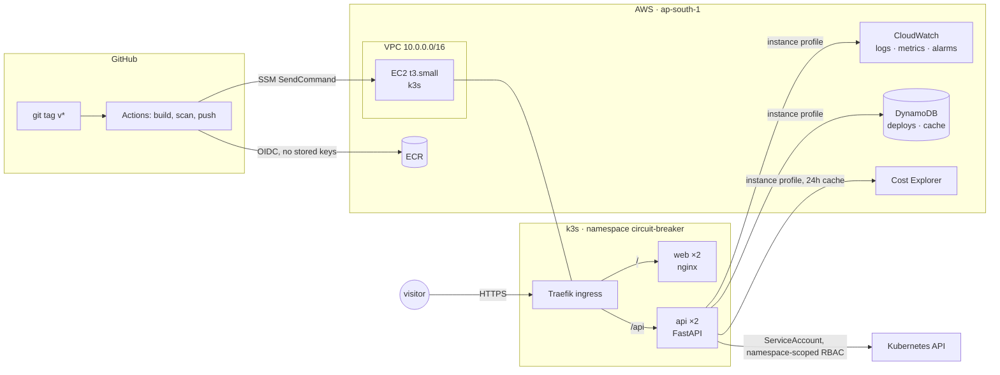

# Circuit Breaker

**[animesh.space](https://animesh.space)** · a portfolio site that reports its own infrastructure, live.

Most portfolio sites list the technologies their author knows. This one runs on
them and shows you the readings: pod status pulled from the Kubernetes API,
metrics from CloudWatch, month-to-date spend from Cost Explorer, and a button
that deletes a running container so you can watch Kubernetes replace it.

Nothing on the infrastructure page is a screenshot.

---

## What it is

A React frontend and a FastAPI backend, containerised, running on Kubernetes on
a single EC2 node. Every AWS resource is defined in Terraform. Every deploy goes
through a tag-triggered GitHub Actions pipeline that authenticates to AWS with
no stored credentials.



## What it demonstrates

| | |
|---|---|
| **Infrastructure as code** | Terraform for VPC, subnet, routing, security groups, EC2, ECR, DynamoDB, IAM, CloudWatch and a budget. Remote state in S3 with locking. |
| **Kubernetes** | Two Deployments behind path-based Ingress. Startup, liveness and readiness probes doing three distinct jobs. Namespace-scoped RBAC, HPA, PodDisruptionBudget, and `preStop` draining for zero-downtime rolling updates. |
| **CI/CD** | Lint, type-check, test and image scanning on every pull request. Semantic-version tags build, push to ECR, deploy over SSM, roll back automatically on a failed rollout, and record the deploy to DynamoDB. |
| **Security** | No access keys anywhere — GitHub authenticates by OIDC, the node by instance profile. IMDSv2 required. Non-root containers, read-only root filesystems, immutable image tags. No Kubernetes Secrets. |
| **Resilience** | A circuit breaker and cache in front of every AWS call. When an upstream fails, the site serves stale data and says so rather than pretending. |
| **Cost engineering** | The whole system runs at roughly $21/month, and the reasoning behind every avoided service is written down. |

## Running it

The site runs entirely on mock data locally — no cluster, no AWS account.

```bash
# API
cd backend
python -m venv .venv && source .venv/bin/activate   # Windows: .venv\Scripts\activate
pip install -e ".[dev]"
MOCK_INFRA=true uvicorn app.main:app --reload --port 8000

# Frontend
cd frontend
npm ci
npm run dev
```

Then <http://localhost:5173>. Every mock response is labelled `mock: true` and
the UI shows a banner — fake telemetry that can't be distinguished from real
telemetry is a liability, not a convenience.

Quality gate:

```bash
cd backend && ruff check . && ruff format --check . && mypy app && pytest
cd frontend && npm run typecheck && npm run build
```

## Deploying

```
terraform/bootstrap    state bucket, applied once
terraform/envs/prod    everything else
deploy/k8s             manifests, applied by the pipeline
```

Full walkthrough in [`terraform/README.md`](terraform/README.md). In short:
apply the bootstrap stack, apply prod, set `AWS_DEPLOY_ROLE` as a repository
variable, then `git tag v1.2.3 && git push --tags`.

Green `main` deploys nothing. Publishing is a deliberate act, which is what makes
a rollback meaningful — every deploy maps to exactly one immutable tag.

## Cost

| | Monthly |
|---|---|
| EC2 `t3.small` | ~$15.50 |
| Public IPv4 | $3.65 |
| EBS 20 GB gp3 | ~$1.60 |
| ECR, DynamoDB, CloudWatch, S3 state | ~$0.20 |
| Cost Explorer API | ~$0.30 |
| **Total** | **~$21** |

Deliberately avoided: **EKS** ($73/mo control plane), **NAT Gateway** ($32/mo),
**ALB** ($18.40/mo). Each is the right answer in production and the wrong one
here, and the reasoning is recorded rather than hidden.

`t3.micro` was tried first and does not work: 790 MiB used and 580 MiB swapped
with only k3s and its own system pods running. Measured, not assumed.

## Repository

```
backend/        FastAPI service — probes, cluster, metrics, cost, deploys, chaos
frontend/       React + TypeScript — the site and the live console
deploy/k8s/     Kubernetes manifests
deploy/scripts/ deploy script, invoked by CI over SSM
terraform/      bootstrap, six modules, one environment
docs/           decisions, ADRs, and the incident log
.github/        CI, release, and Terraform workflows
```

## Documentation

- **[`docs/decisions.md`](docs/decisions.md)** — every non-obvious choice in the
  project, what was rejected, and what it cost. Roughly eighty entries.
- **[`docs/adr/`](docs/adr/)** — full architecture decision records for the
  substantial ones.
- **[`docs/interview-stories.md`](docs/interview-stories.md)** — the things that
  broke and what they taught, written while the details were fresh.

## What I would change at scale

Being explicit about the compromises, because a project without stated
trade-offs is a project whose author hasn't found them yet.

**k3s on one node is not highly available.** The control plane, the workloads
and the data all die with that instance. Production wants EKS across three
availability zones, and the manifests here would move across unchanged.

**No NAT gateway means workloads sit in a public subnet.** Security groups do
the work. Correct production design puts them in private subnets behind NAT, or
uses VPC endpoints for AWS-service traffic — both cost more than this entire
project.

**The frontend belongs on a CDN.** Running nginx in-cluster was chosen to have
real multi-service routing to demonstrate. S3 and CloudFront would be cheaper,
faster and simpler.

**The chaos endpoint's rate limit is per-process**, so N replicas allow N
deletions per window. The replica floor bounds the damage; the correct fix is a
shared counter in DynamoDB.

**Swap on the node is a lab affordance.** Swapping a latency-sensitive workload
turns a fast service into a slow one. The honest alternative is a bigger
instance.

**No `terraform plan` in CI.** A plan needs to read every resource in the
account and write a lock object, which means a role far broader than the deploy
role. The right version is a separate read-only plan role; bolting those
permissions onto the deploy role for a nicer PR comment would be a poor trade.

---

Built and operated by **Animesh Samal** — [animesh.space](https://animesh.space)
· [LinkedIn](https://www.linkedin.com/in/animesh-samal-a63366b9/)
